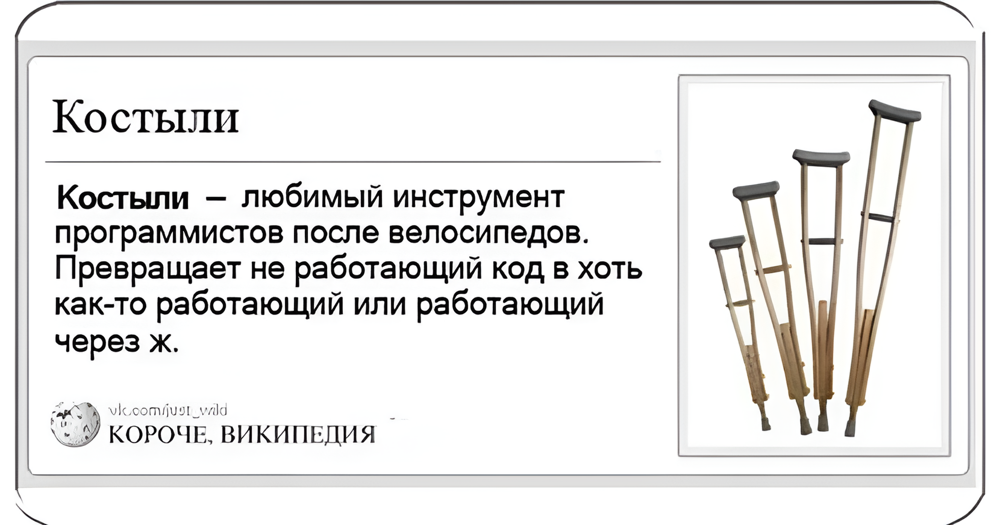

<!DOCTYPE html>
<html lang="ru">
<head>
    <meta charset="UTF-8">
    <meta name="viewport" content="width=device-width, initial-scale=1.0">
    <title>🦿 kostylpy — Профессиональная библиотека костылей для Python</title>

</head>
<body>

<h1 align="center">
    
     
    🦿 kostylpy
</h1>

    <strong>Профессиональная библиотека костылей для Python</strong>
     
    <em>"Работает — не трогай. Не работает — добавь костылей."</em>

    
    
    
    
    

    <b>
        <a href="#install">📦 Установка</a> •
        <a href="#quickstart">🚀 Быстрый старт</a> •
        <a href="#features">🎯 Возможности</a> •
        <a href="#cli">🖥️ CLI</a> •
        <a href="#structure">📁 Структура</a> •
        <a href="#examples">🎮 Примеры</a> •
        <a href="#tests">🧪 Тесты</a> •
        <a href="#license">📜 Лицензия</a>
    </b>

<h2>🤔 Что это?</h2>

Просто импортируй этот модуль, и весь твой код станет <strong>неубиваемым</strong>. Мы патчим всё: <code>print</code>, <code>open</code>, <code>import</code>, деление, индексы, атрибуты — даже сам интерпретатор начинает работать через костыли.

    

        <h3>🛡️ Защита от падений</h3>
        
Ваш код никогда не упадёт. Никогда. Серьёзно.

    

    

        <h3>🔄 Авто-восстановление</h3>
        
Повторные попытки, fallback-значения, circuit breaker.

    

    

        <h3>📊 Метрики и логи</h3>
        
Полный мониторинг костылей в реальном времени.

    

    

        <h3>☕ Кофе-метрика</h3>
        
Считает количество выпитого кофе. Жизненно важно.

    

<h2 id="install">📦 Установка</h2>

<pre><code>pip install kostylpy</code></pre>

<h3>Из исходников:</h3>
<pre><code>git clone https://github.com/become-a-human/kostylpy.git
cd kostylpy
pip install -e .</code></pre>

<h3>С опциональными зависимостями:</h3>
<pre><code>pip install kostylpy[all]     # Всё сразу
pip install kostylpy[yaml]    # YAML конфиги
pip install kostylpy[psutil]  # Метрики памяти</code></pre>

<h2 id="quickstart">🚀 Быстрый старт</h2>

<pre><code>import kostylpy as kp

# Всё! Теперь ваш код под защитой!

print("Hello World!")  # Никогда не падает

f = open("/nonexistent/file.txt")  # Не падает!
print(f.read())  # ""

import super\_mega\_library  # Не падает!

@kp.safe(fallback="Всё ок!")
def risky\_function():
    raise ValueError("Ошибка!")

print(risky\_function())  # "Всё ок!"</code></pre>

<h2 id="features">🎯 Основные возможности</h2>

<h3>🛡️ Декораторы</h3>
<pre><code>@kp.safe(fallback="запасное значение")
def api\_call():
    return requests.get("https://api.example.com")

@kp.retry(max\_attempts=3, delay=0.1, backoff=2.0)
def flaky\_operation():
    return connect\_to\_database()

@kp.fallback(0)
def divide(a, b):
    return a / b

@kp.cached(max\_size=128, ttl=60)
def expensive\_computation(x, y):
    time.sleep(1)
    return x * y</code></pre>

<h3>📦 Контекстные менеджеры</h3>
<pre><code>with kp.KostylContext("опасная операция"):
    result = 1 / 0  # Не упадёт!

with kp.TimerContext("запрос к БД") as timer:
    db.query("SELECT * FROM users")
print(f"Запрос занял {timer.elapsed:.2f}с")

with kp.SafeFileContext("config.json", "r") as f:
    config = json.load(f.read())</code></pre>

<h3>✅ Валидаторы</h3>
<pre><code>kp.TypeValidator(int).validate(42).is\_valid       # True
kp.StringValidator(min\_length=3, max\_length=50)
kp.EmailValidator().validate("user@example.com").is\_valid
kp.PasswordValidator(min\_length=8, require\_emoji=True)  # 🔒</code></pre>

<h3>📊 Утилиты</h3>
<pre><code>data = kp.DotDict({'users': [{'name': 'Alice'}]})
kp.safe\_get(data, 'users.0.name', default='Unknown')  # 'Alice'

kp.safe\_divide(100, 0, default=float('inf'))  # float('inf')

items = kp.SafeList([1, 2, 3], default=0)
items[100]  # 0, не IndexError!

kp.human\_readable\_size(1234567)   # "1.2 МБ"
kp.time\_ago(3661)                 # "1 час назад"</code></pre>

<h3>📈 Метрики и логирование</h3>
<pre><code>kp.metrics.record\_operation(success=True, duration=0.05)
kp.metrics.coffee.drink(duration=300.0)

kp.logger.info("Система запущена")
kp.logger.warning("Заканчивается кофе!")
kp.logger.coffee("Кофе-брейк!")
kp.logger.kostyl("Применён костыль")</code></pre>

<h2 id="cli">🖥️ CLI</h2>

<pre><code>python -m kostylpy run main.py
python -m kostylpy scan main.py
python -m kostylpy patch main.py -o fixed.py
python -m kostylpy patch ./project --aggressive
python -m kostylpy check
python -m kostylpy report
python -m kostylpy version
python -m kostylpy help</code></pre>

<h2 id="structure">📁 Структура проекта</h2>

<pre><code>kostylpy/
├── kostylpy/
│   ├── \_\_init\_\_.py
│   ├── \_\_main\_\_.py
│   ├── core.py
│   ├── config.py
│   ├── constants.py
│   ├── exceptions.py
│   ├── utils.py
│   ├── decorators.py
│   ├── context\_managers.py
│   ├── validators.py
│   ├── factories.py
│   ├── interceptors.py
│   ├── metrics.py
│   ├── logging\_kostyl.py
│   ├── async\_kostyl.py
│   ├── patcher.py
│   ├── patterns.py
│   └── monkey\_patcher.py
├── tests/
│   ├── test\_core.py
│   ├── test\_decorators.py
│   ├── test\_patcher.py
│   ├── test\_interceptors.py
│   └── test\_integration.py
├── examples/
│   ├── hello\_world.py
│   ├── web\_server.py
│   ├── data\_science.py
│   └── production.py
├── docs/
├── setup.py
├── pyproject.toml
├── LICENSE
└── README.md</code></pre>

<h2 id="tests">🧪 Тесты</h2>

<pre><code># Все тесты
python -m pytest tests/ -v

# Конкретный модуль
python -m pytest tests/test\_decorators.py -v

# С coverage
python -m pytest tests/ --cov=kostylpy --cov-report=html</code></pre>

<h2 id="examples">🎮 Примеры</h2>

<table>
    <tr><th>Пример</th><th>Описание</th><th>Запуск</th></tr>
    <tr><td><code>hello\_world.py</code></td><td>Базовое использование</td><td><code>python examples/hello\_world.py</code></td></tr>
    <tr><td><code>web\_server.py</code></td><td>Веб-сервер на костылях</td><td><code>python examples/web\_server.py</code></td></tr>
    <tr><td><code>data\_science.py</code></td><td>Анализ данных</td><td><code>python examples/data\_science.py</code></td></tr>
    <tr><td><code>production.py</code></td><td>Продакшен-система</td><td><code>python examples/production.py</code></td></tr>
</table>

    <h2>⚠️ Дисклеймер</h2>
    
<strong>Эта библиотека — шутка. Серьёзно.</strong>

    
Не используйте её в реальном продакшене. Хотя... она и так работает. На костылях.

    <ul>
        <li>Может замедлить код в 1000 раз</li>
        <li>Может скрыть реальные ошибки</li>
        <li>Вызывает привыкание к костылям</li>
    </ul>

<h2 id="license">📜 Лицензия</h2>

    

        Эта библиотека распространяется под лицензией
    

    

        

            <strong>WTFPL</strong>
        

        

            + 🦿 <strong>Kostyl Clause</strong>
        

    

    

        

            
✅

            
Делайте что хотите

        

        

            
🦿

            
Добавляйте костыли

        

        

            
☕

            
Пейте кофе

        

    

    

        📄 Всё остальное — в <a href="LICENSE">полном тексте лицензии</a>.
         
        <small>(Спойлер: там тоже ничего важного.)</small>
    

    <strong>Made with 🦿, ☕ and infinite crutches</strong>
     
     
    Kostylpy © 2026 — настоящее и будущее костыльной разработки
     
     
    <a href="#top">К оглавлению</a>
     

</body>
</html>